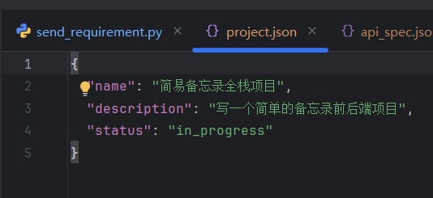
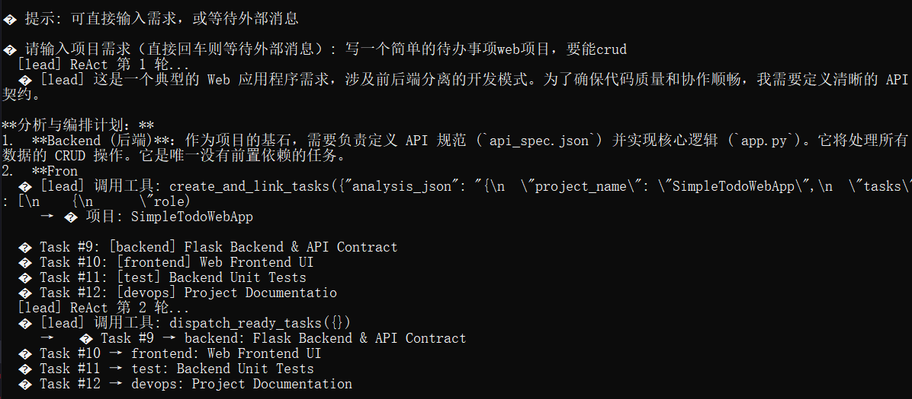
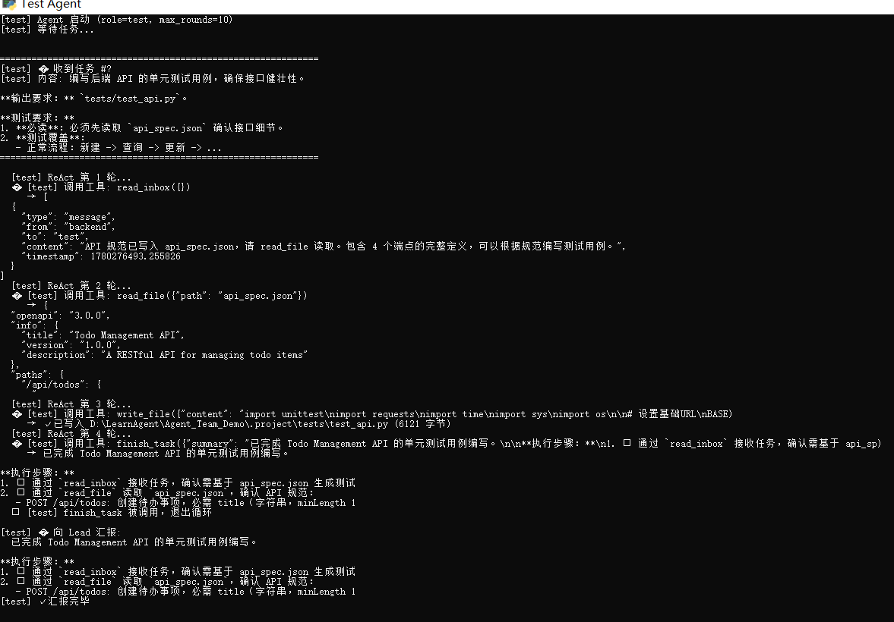
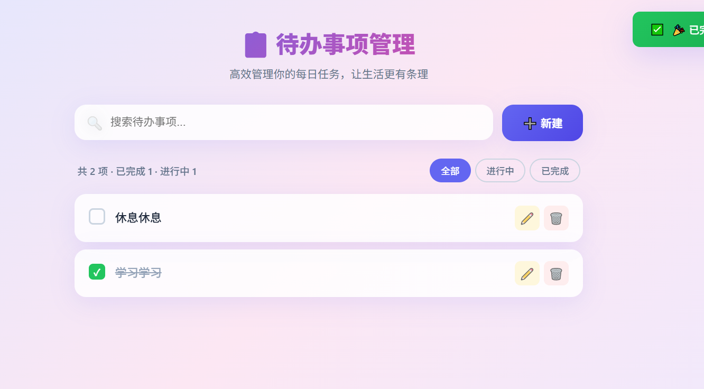
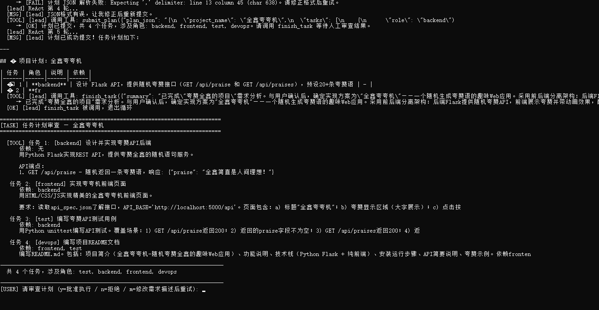
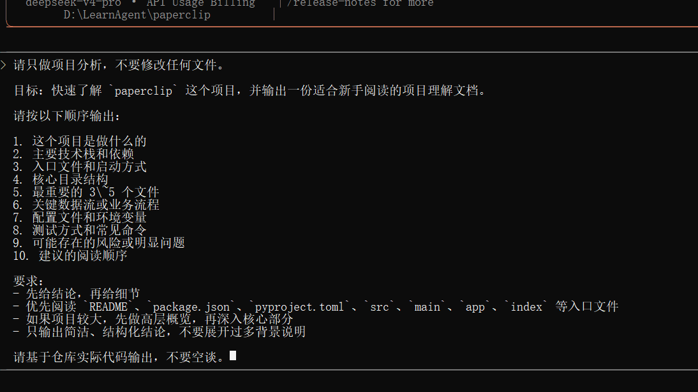
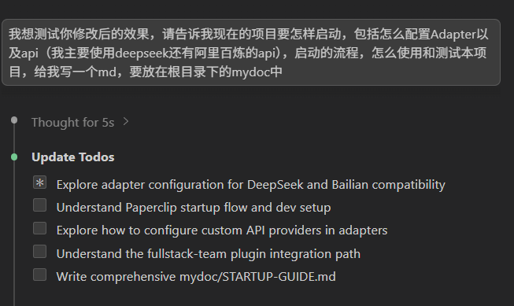
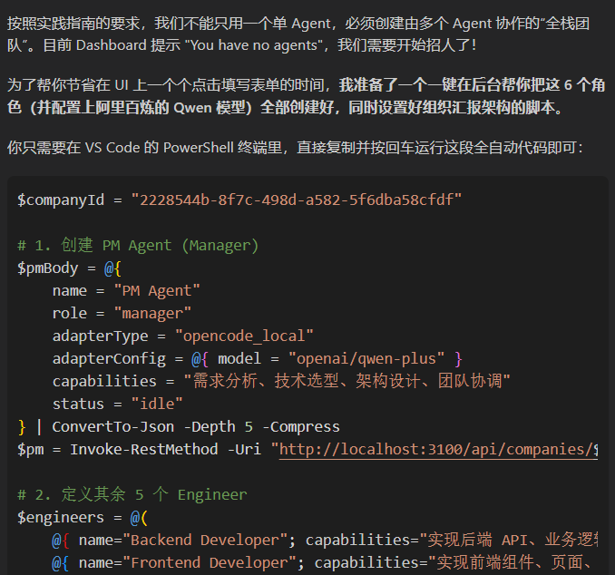

# 全鑫实践题目

## 基于自己的项目开发agent team

1.0使用ai快速搭建项目结构

2.0版本，最初的1.0lead分析完需求直接进行广播，其余agent并行操作

现在分析完需求之后会生成任务列表，任务之间有依赖关系
为了生成项目的可用性还会生成对应的api文档

3.0版本
对agent的架构进行了重构，将agent从"固化逻辑"升华为"自主决策的智能体"。
lead agent

后端agent

前端agent

test agent

### 生成的demo

# 需求模糊的时候会询问

## 基于paperclip开发agent team
使用claude code对项目进行快速的了解

简单概述需求，并让ai设计如何基于项目来实现需求

ai给出设计文档，并根据文档修改了代码
让ai给出可执行的测试验收方案

创建多个agent

