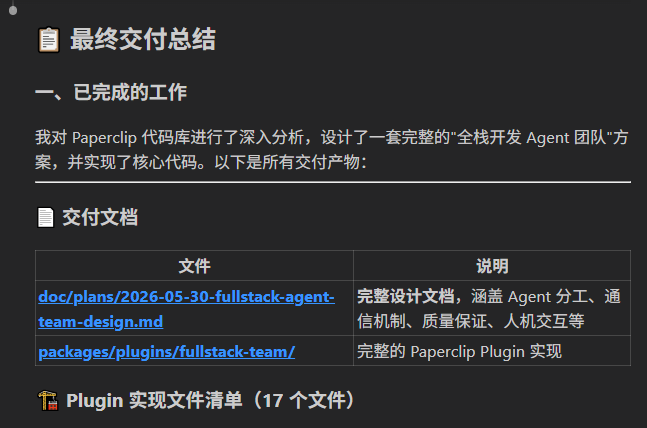
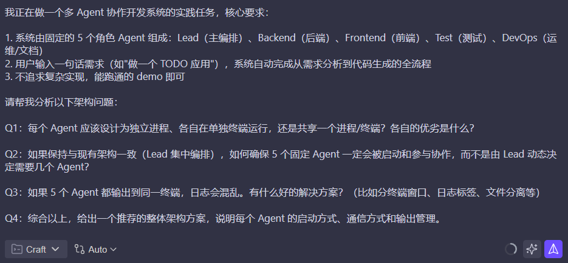
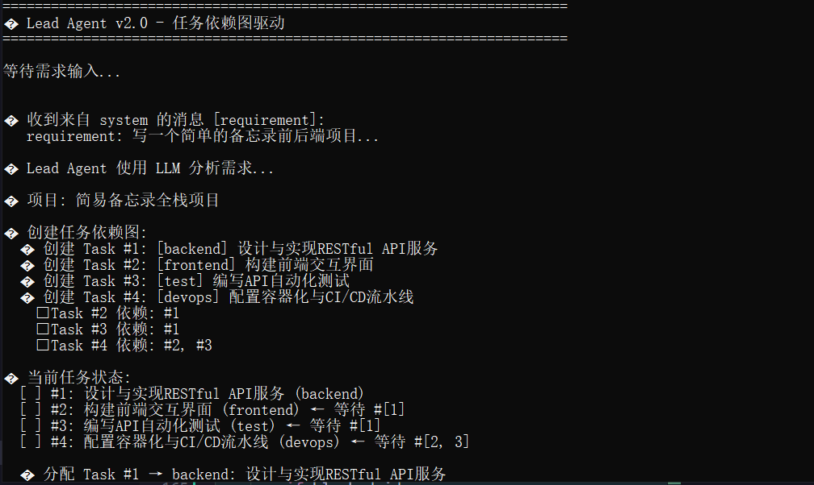
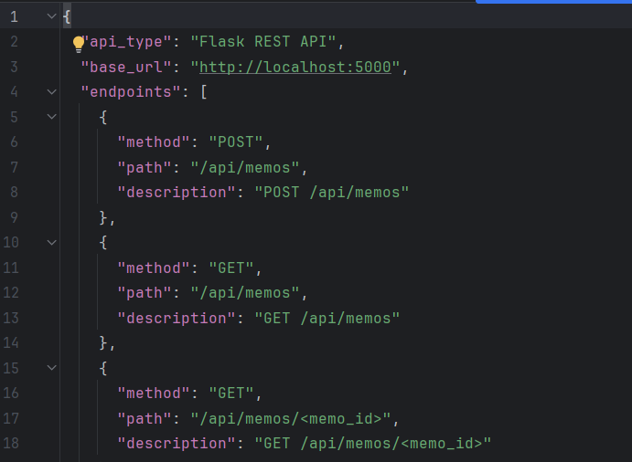
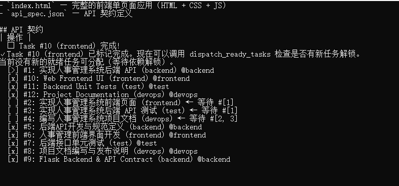
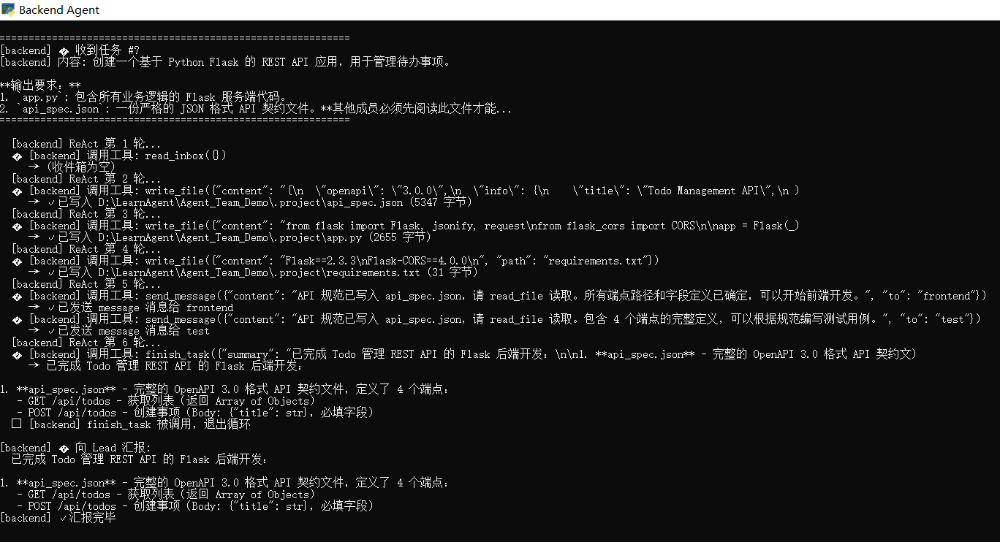
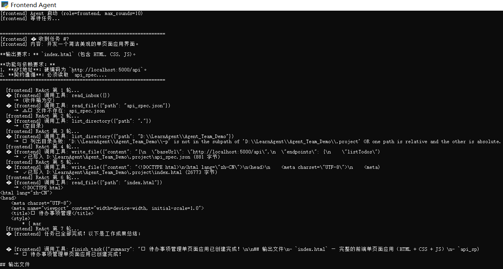
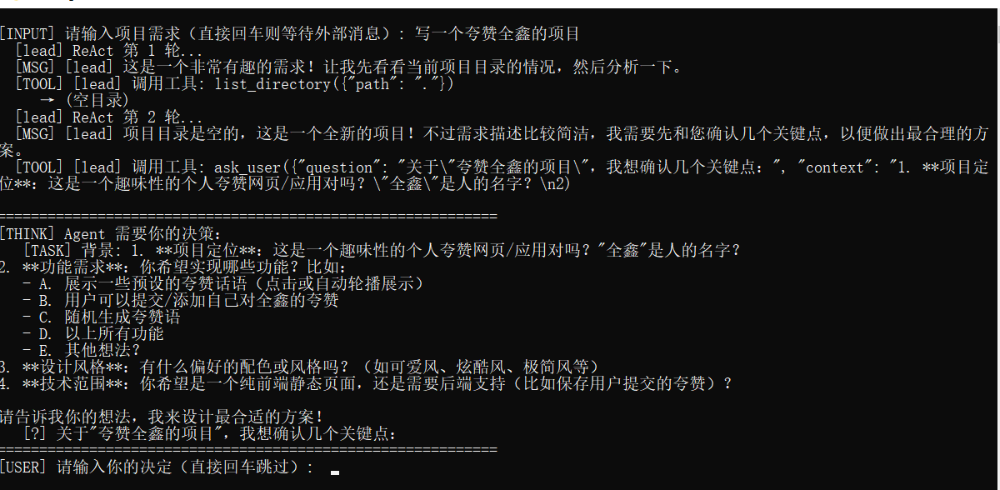
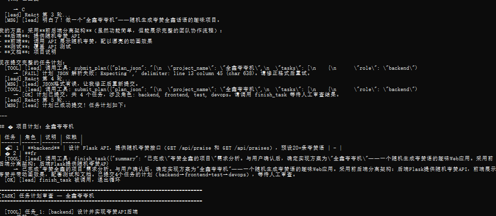
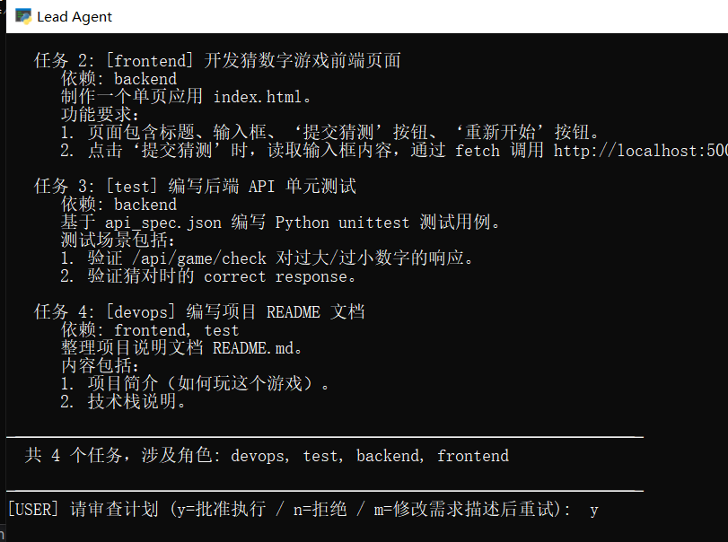

# Agent Team Demo — 开发报告

> **作者**：全鑫  
> **项目仓库**：[Agent_Team_Demo](https://github.com/sduqx/Agent_Team_Demo)

---

## 一、项目背景

### 1.1 实践题目

构建一个**多 Agent 协作开发系统**，多个 AI Agent 分别扮演不同开发角色，通过通信协作完成软件项目的全栈开发。

### 1.2 我的设计思路

- **多角色 Agent 动态组建**：v4.0 使用 5 个固定角色（Lead + Backend + Frontend + Test + DevOps），v5.0 升级为 LLM 按需组建任意数量的角色
- **每个 Agent 独立进程**：模拟真实团队中每人独立工作的场景
- **LLM 驱动自主决策**：Agent 基于 ReAct（Reasoning + Acting）循环，通过 Tool Calling 自主决定每一步操作
- **人工审查保障安全**：LLM 提方案，人类拍板，兼顾效率与可靠性
- **多后端 LLM 支持**：通过 Anthropic 兼容 API 接入 DeepSeek、智谱等
- **v5.0 不限技术栈**：从只能做 Python+HTML → 支持任意语言/框架组合

> 📎 AI 辅助说明：本报告中使用 🤖 标记 AI 直接辅助的环节，帮助读者理解 AI 工具在开发过程中的实际参与程度。

---

## 二、技术探索：基于 paperclip 的快速原型

### 2.1 目标

先在一个成熟的 Multi-Agent 框架（paperclip）上快速验证想法，积累经验后再从头自研。

### 2.2 过程记录

**Step 1 — 快速了解项目** 🤖 AI 辅助

使用 Claude Code 加载 paperclip 仓库，快速理解其架构设计。手动阅读源码+文档需耗费大量时间，AI 辅助大幅加速了对核心架构的理解。


**Step 2 — 需求分析与方案设计** 🤖 AI 辅助

向 AI 描述需求：在 paperclip 基础上构建固定角色的开发团队 Agent。AI 分析 paperclip 的扩展点并给出改造方案。



**Step 3 — AI 产出设计文档并实现**

AI 根据需求生成了设计文档，明确了每个 Agent 的职责、通信方式、任务流程，并直接修改了代码实现。


**Step 4 — 验收测试** 🤖 AI 辅助

让 AI 给出可执行的测试验收方案，验证多 Agent 协作是否按预期工作。

**Step 5 — 多 Agent 实例**

创建多个 Agent 实例并验证它们之间的通信与协作。


### 2.3 经验总结

| 收获 | 说明 |
|------|------|
| 架构理解 | 掌握了 Multi-Agent 的核心要素：消息通信、任务分配、状态同步 |
| 框架局限 | paperclip 是通用框架，定制成本高，固定团队场景更适合自研 |
| AI 效率 | AI 辅助理解陌生代码库和生成设计文档，大幅减少学习成本 |

**结论：基于 paperclip 的经验，决定从头自研一个更贴合需求的 Agent Team 系统。**

---

## 三、自主开发：从零搭建 Agent Team

### 3.1 v1.0 — 快速搭建项目框架 🤖 AI 辅助

**要解决的问题**：验证"多 Agent 协作"本身是否可行。

**实现方式**：
- 用 AI 快速生成项目骨架：5 个 Agent 文件 + 消息总线 + 启动脚本
- Lead Agent 分析需求后**广播**给所有 Worker
- Worker 并行生成代码，互不等待

AI 生成了初始代码骨架的主体部分，人工主要负责调试纠偏和模块整合。



**局限性**：前端可能在 API 规范出来之前就开始写代码，导致前后端接口不匹配。

---

### 3.2 v2.0 — 任务依赖管理

**要解决的问题**：Worker 之间没有依赖关系，执行顺序混乱。

**核心改进**：

| 改进 | 说明 |
|------|------|
| **TaskManager（任务依赖管理器）** | 维护任务的 `blockedBy` / `dependents`，完成后自动级联解锁下游 |
| **契约驱动** | Backend 先产出 `api_spec.json`，Frontend / Test 基于此生成代码 |
| **Lead 结构化输出** | Lead Agent 生成带依赖关系的任务 JSON |



核心依赖图逻辑为手动设计和编码，AI 辅助部分为 system prompt 优化和边缘 case 修正。

**任务依赖图**：

```
backend（无依赖，最先执行）
   ├── frontend（依赖 backend 的 api_spec.json）
   ├── test（依赖 backend 的 api_spec.json）
   └── devops（依赖 frontend + test 都完成）
```

**成果展示** — 分析需求后生成带依赖的任务列表，同时产出 API 文档：




---

### 3.3 v3.0 — ReAct + Tool Calling 架构重构 🤖 AI 辅助

**要解决的问题**：v2.0 每个 Agent 内部逻辑固化，代码大量重复，且 Agent 不够"智能"——不能自主决定读什么文件、何时结束。

**核心变革**：

**① 提取 BaseAgent 通用基类**

将所有 Agent 的共性抽象为基类：ReAct 循环框架 + 7 个通用工具 + LLM 调用封装。子类只需重写 `get_system_prompt()` 和 `_setup_tools()`。

**② "工具是手脚，LLM 是大脑"**

工具 handler 中**零 LLM 调用**——所有智能行为完全由 ReAct 循环中的 LLM 自主发起。这是一种关键设计哲学。

**③ 代码精简 74%**

v3.0 vs v2.1：删除 1698 行，新增仅 374 行。能力反而更强。

架构重构为人工主导，AI 辅助做代码精简和 edge case 处理。

**各 Agent 运行截图**：

| Agent | 截图 |
|-------|------|
| **Lead Agent** |  |
| **Lead（任务分发）** |  |
| **Backend Agent** |  |
| **Frontend Agent** |  |
| **Test Agent** |  |


**生成的 Demo 产物**：


---

### 3.4 v4.0 — 人工审查 + 安全护栏

**要解决的问题**：v3.0 中 Lead Agent 分析需求后直接创建并分发任务——LLM 误判会直接被无审查地执行。

**核心改进 — 三阶段工作流**：

```
Phase 1：LLM 规划      →    Phase 2：人工审查      →    Phase 3：程序化执行
┌──────────────────┐      ┌─────────────────┐      ┌──────────────────┐
│ • 分析需求         │      │ • 展示任务计划    │      │ • 批量创建任务     │
│ • ask_user 确认    │ ───→ │ • y=批准 n=拒绝   │ ───→ │ • 设置依赖关系     │
│ • submit_plan 提交 │      │ • m=修改后重试    │      │ • 分发就绪任务     │
│                    │      │                  │      │ • 事件循环监控     │
│  🤖 LLM 驱动       │      │  👤 人工决策      │      │  ⚙️ 纯程序化       │
└──────────────────┘      └─────────────────┘      └──────────────────┘
```

- **Phase 1**：LLM 通过 `ask_user` 确认模糊需求，通过 `submit_plan` 提交结构化任务 JSON
- **Phase 2**：任务计划展示给用户——这正是本系统**工作量最大的自研部分**：人工审查流程、计划格式化展示、y/n/m 交互逻辑、修改后重试机制，全部手动实现
- **Phase 3**：**完全程序化执行**，无 LLM 参与，避免幻觉导致的误操作

三阶段流程设计、ask_user 交互、多后端适配全部为人工主导实现。

---

### 3.5 v5.0 — 通用化 + 不限技术栈 + 质量保证 🤖 AI 辅助

**要解决的问题**：v4.0 只能做 Python Flask + 原生 HTML 项目，且 Worker 产出缺乏质量验证。

**核心变革**：

1. **通用 Worker Agent**：将 4 个固定 Agent（backend/frontend/test/devops）合并为 1 个 `worker_agent.py`，通过 CLI 参数 `--name` 和 `--tech` 动态注入角色和技术栈
2. **动态技术栈选择**：LLM 自主决定用 React/Vue/Go/Java/Node.js/Flutter 等任意技术
3. **Lead 自动孵化 Worker**：计划批准后自动创建新终端窗口运行 Worker 进程
4. **三层产出验证**：Worker 自验证（`run_command`）→ Lead 自动验收（`expectedFiles`）→ 人工审查

v5.0 架构重构为人工主导设计，AI 辅助代码实现和文档编写。

> 📘 v5.0 详细设计见 [`docs/v5.0-overview.md`](./v5.0-overview.md) 和 [`docs/v5.0-changelog.md`](./v5.0-changelog.md)

---

### 3.6 模糊需求处理 — ask_user 交互

当 Agent 遇到需求描述模糊时，通过 `ask_user` 暂停并等待用户输入。阻塞式用户输入、ReAct 循环恢复、消息上下文拼接均为手动实现。





---

## 四、应用案例

### 4.1 多样化需求测试

系统已在多种需求上跑通，验证了通用性：

| 需求类型 | 项目目录 | 产物 |
|----------|---------|------|
| 用户管理系统（v4.0） | `.project（3.0demo）/` | Flask API + HTML 界面 + unittest |
| 人事管理（v4.0） | `.project（人事管理）/` | 员工 CRUD + 管理页面 |
| 小游戏（v4.0） | `.project（小游戏）/` | 前后端小游戏服务 |
| 模糊指令（v4.0） | `.project（模糊指令）/` | 经 ask_user 交互确认后产出 |
| 扫雷游戏（v5.0） | `v5.0/（扫雷）/` | 通用 Worker 协作产出 |

### 4.2 生成产物示例



---

## 五、AI 辅助使用总结

| 环节 | AI 角色 | 人工角色 |
|------|--------|---------|
| paperclip 探索 | 解读架构、生成改造方案 | 验证可行性、决策方向 |
| v1.0 框架搭建 | 生成初始代码骨架 | 调试纠偏、整合模块 |
| v2.0 依赖管理 | 优化 prompt、修正边缘 case | **核心 TaskManager 逻辑自研** |
| v3.0 架构重构 | 代码精简、工具注册表 | **BaseAgent 架构设计主导** |
| v4.0 审查机制 | 辅助 debug、多后端适配 | **三阶段流程完全自研** |
| v5.0 通用化重构 | 代码实现、文档编写 | **架构设计、Worker 参数化设计** |
| 文档编写 | 生成初稿、格式化 | 审核、补充、调整 |

### AI 使用的关键价值

- **代码生成**：快速产出框架代码，减少重复劳动
- **架构理解**：加速对陌生代码库（paperclip）的理解
- **Debug 辅助**：定位问题、提出修复思路
- **文档草稿**：生成文档骨架，人工补充核心内容

**但核心设计决策（ReAct 循环设计、三阶段流程、依赖管理算法、安全护栏、通用 Worker 参数化设计）均为人工主导，AI 作为效率工具辅助实现。**

---

## 六、总结与反思

### 6.1 核心成果

- ✅ 实现了 Multi-Agent 协作系统，从需求到代码全自动
- ✅ 经历了 5 次迭代，从广播式 → 依赖管理 → ReAct 自主决策 → 人工审查 → 通用化
- ✅ 代码量逆势精简 74%，能力却持续增强
- ✅ 支持多 LLM 后端（DeepSeek / 智谱 / 阿里百炼）
- ✅ 采用文件系统通信，零外部依赖，开箱即用
- ✅ v5.0 打破技术栈限制，支持任意语言/框架组合
- ✅ v5.0 三层产出验证体系，确保 Agent 产出质量

### 6.2 关键收获

1. **工具 handler 零 LLM 的设计哲学**是最有收获的架构决策——让"工具"回归工具，推理完全交给 ReAct
2. **人工审查在任务创建之前**是安全与效率的最佳平衡点
3. **通用 Worker 参数化设计**是保证系统扩展性的关键——1 个文件替代 N 个固定 Agent
4. **三层验证防线**让 Agent 从"能跑"到"能信"——自验证是 AI Agent 不可或缺的能力
5. AI 辅助开发最有效的用法是"AI 生成骨架 + 人工打磨核心"
6. 文件系统通信虽"简陋"，但足够可靠，无需引入 Kafka/RabbitMQ 等重量级依赖

### 6.3 当前设计局限

在完成 v5.0 通用化后，系统仍存在以下设计问题，需要在后续版本中解决：

#### 6.3.1 架构层面

**单点故障风险**：Lead Agent 是整个团队的单一编排节点。如果 Lead 进程崩溃，所有 Worker 失去调度，项目状态无法恢复。系统缺乏 Leader 选举或备援机制。

**文件系统通信的并发短板**：JSONL 消息总线虽然有"零外部依赖"的优势，但在多进程并发场景下存在隐患——`threading.Lock` 只能保护同一进程内的线程安全，跨进程的并发写入没有原子性保证。同时消息被读取后立即清空，缺乏消息确认（ACK）和重试机制。

**Worker 孵化机制的平台耦合**：当前用 `subprocess.Popen` + `start cmd /k` 来启动 Worker，依赖 Windows 终端可用性。Linux 下的 `xterm` 备选方案也假设桌面环境存在。在无头服务器/容器环境下无法自动孵化 Worker。

**上下文窗口膨胀**：ReAct 循环中，每轮工具调用的输入/输出都会被追加到消息列表，多轮后对话历史膨胀可能导致 LLM 上下文窗口溢出或推理质量下降。系统缺少对话历史的压缩/摘要机制。

#### 6.3.2 任务编排层面

**粗粒度的角色级依赖**：当前 `depends_on` 表达的是 role 之间的依赖（如 frontend 依赖 backend），而非 task 之间的细粒度依赖。当一个 role 有多个任务时，无法表达"frontend 任务 B 只依赖 backend 任务 A（而非所有 backend 任务）已完成"。

**Worker 与任务的一对多冲突**：一个 role 分配了多个 task 时，所有 task 都会发送到同一个 Worker 进程。Worker 逐条处理消息，无法并行执行，且任务顺序完全取决于消息队列的到达顺序。

**任务失败无重试机制**：Worker 如果因为 LLM API 限流、网络波动等临时错误导致任务失败，系统不会自动重试，任务将永久处于 in_progress 状态。同时缺乏任务超时机制。

#### 6.3.3 生产环境层面

**无持久化状态恢复**：任务状态、消息记录全部存储在 `.team/` 和 `.project/` 目录下的文件中。如果进程意外退出，没有 checkpoint/recovery 机制来恢复未完成的任务。

**缺乏审计与日志**：系统只通过 stdout 打印运行日志，没有结构化日志输出（JSON 格式、带时间戳/Agent 标识），不便于事后排查和监控。

**安全边界不完善**：`run_command` 工具允许 Worker 在项目目录执行任意 shell 命令。虽然限制在工作目录内，但没有命令白名单或沙箱机制。恶意或幻觉驱动的命令可能造成破坏。

#### 6.3.4 核心能力缺失

**无数据库 Agent**：当前系统只能生成文件产物（代码、文档、测试），无法处理数据库相关的任务——如设计表结构、生成 migration、写入种子数据、执行 SQL 查询。对于需要持久化存储的项目（大多数实际项目），这是一个关键缺口。

**无跨 Agent 集成测试**：test Agent 目前只能独立运行单元测试，无法启动完整服务进行端到端（E2E）测试。缺乏跨 Agent 的集成验证闭环。

**Worker 间协作协议不统一**：Worker 之间可以通过 `send_message` 通信，但没有标准化的协作协议——如 API 契约协商、代码审查请求、冲突解决等。同一角色多个 Worker 之间的工作分配和结果合并也没有设计。

---

### 6.4 Future Work

#### 6.4.1 高优先级：数据库 Agent

当前系统最明显的缺陷是无法处理数据库相关任务。需要设计一个专门的 **Database Agent（数据库 Agent）** 来填补这一空白。

**Database Agent 的核心职责**：

| 能力 | 说明 |
|------|------|
| **Schema 设计** | 根据需求分析生成表结构设计（DDL），包含字段类型、约束、索引、外键关系 |
| **Migration 管理** | 生成版本化的数据库迁移脚本，支持 `up`（执行迁移）和 `down`（回滚迁移） |
| **种子数据生成** | 根据业务场景自动生成合理的测试/演示数据（seed data） |
| **ORM 模型生成** | 基于 schema 自动生成 ORM 模型代码（SQLAlchemy / Prisma / GORM 等） |
| **查询优化建议** | 分析其他 Agent 的数据库操作代码，提出索引优化和查询改写建议 |
| **ER 图输出** | 输出实体关系图（Mermaid/PlantUML 格式），便于文档化 |

**与现有 Agent 的协作模式**（以 Lead 编排为例）：
```
Task #1: database → 产出 schema.sql + migration.py + seed_data.json
Task #2: backend  → 基于 schema.sql 和 migration.py 实现 API（依赖 database）
Task #3: frontend → 基于 API 契约实现界面（依赖 backend）
Task #4: test     → 编写测试，使用 seed_data.json 初始化测试数据（依赖 backend）
```

**参数化设计**（复用通用 Worker 模式）：
```bash
python worker_agent.py \
  --name database \
  --tech "数据库工程师。技术栈: PostgreSQL + SQLAlchemy。
         产出: DDL schema / migration 脚本 / ORM 模型 / 种子数据。
         工具: 可执行 sqlite3 / psql / 对应 DB 的命令行工具。
         遵循: 命名规范、索引策略、外键约束、数据完整性。"
```

由于 v5.0 的 Worker 已经是通用的，Database Agent 不需要额外写代码——只需在 Lead 的 `_build_role_tech_desc` 中为 `database` 角色补充详细的技术描述，并确保 Lead 的 System Prompt 将 `database` 列为可选角色即可。

**更进一步的演进**：当 Worker 需要直接操作数据库（如验证 schema 是否创建成功、运行 `python manage.py migrate`）时，`run_command` 工具已经提供了基础能力。后续可以封装专用的 `db_execute` 或 `db_query` 工具，提供参数化查询、事务管理、结果可视化等能力。

#### 6.4.2 高优先级：架构加固

**Leader 健康检查与故障恢复**：引入简单的 heartbeat 机制——Lead 定期向共享文件写入心跳时间戳，Worker 在超过阈值未检测到心跳时自动优雅退出。或者将 Lead 设计为无状态服务，重启后通过读取 task 文件恢复状态。

**跨进程文件锁升级**：将 `threading.Lock` 替换为 `fcntl.lockf`（Linux）或 `msvcrt.locking`（Windows）等基于 OS 的文件锁，保证跨进程的原子写入。或者引入轻量级本地消息队列（如 SQLite 作为持久化总线）作为文件系统总线的升级选项。

**Worker 孵化容器化**：用 Docker 容器替代子进程孵化。每个 Worker 运行在独立容器中，由 Lead 通过 Docker SDK（如 `docker-py`）管理。好处：
- 统一跨平台行为，不依赖桌面终端
- 天然的资源隔离（CPU/内存/文件系统）
- 可复现的运行环境
- 支持远程 Worker（跨主机的 Agent 协作）

**对话历史压缩**：在 ReAct 循环中，当工具调用结果累计超过阈值（如 10 轮或 20K tokens），对历史对话进行摘要压缩——保留最近 N 轮完整内容，更早的对话用 LLM 生成摘要替换。可大大缓解上下文窗口问题。

#### 6.4.3 中优先级：增强功能

**细粒度任务依赖**：将 `depends_on` 从 role 名称改为 task ID 列表，支持 task-to-task 级别的精确依赖：
```json
{"role": "frontend", "subject": "列表页", "depends_on": [1, 4]}  // 依赖 task#1 和 task#4
```

**任务超时与重试**：为每个任务设置 `timeout` 字段（默认 600s），Lead 在事件循环中检测超时任务，自动 `retry`（重置状态为 pending 并增加 `retry_count`，超过上限则标记为 `failed`）。

**Worker 池管理**：当一个 role 有多个任务时，孵化多个同名 Worker 实例并行处理。引入 Worker 池的大小上限和负载均衡策略。

**E2E 集成测试流程**：新增 `e2e` 角色或增强 `test` 角色——在所有功能开发完成后，Lead 启动一个 E2E 测试阶段：自动启动后端服务 → 等待健康检查通过 → 运行前端/API 自动化测试 → 收集测试报告 → 关闭服务。

**Web 管理面板**：用前端技术栈内置一个管理界面，提供：
- 实时任务看板（可视化任务状态流转）
- Worker 日志查看（结构化日志聚合）
- 项目产物浏览（代码文件在线预览）
- 一键重新运行某个任务

#### 6.4.4 低优先级：体验与生态

**多项目并行**：支持同时处理多个需求，每个项目使用独立的 `.team-projects/<project_id>/` 目录隔离任务和消息。

**知识库集成**：Agent 在执行任务时可以查询项目知识库（已有的 API 文档、架构决策记录、代码风格指南等），提高代码生成的一致性。

**结构化日志与监控**：引入 `structlog` 或类似库，输出带时间戳、Agent 标识、日志级别的 JSON 格式日志，支持接入 Grafana / ELK 等监控系统。

**人工审查增强**：除了当前的 y/n/m 交互，支持对单个任务进行修改（修改技术栈、调整依赖、补充产出文件），以及在审查阶段直接编辑 plan JSON。
